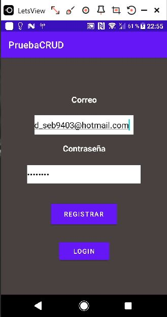
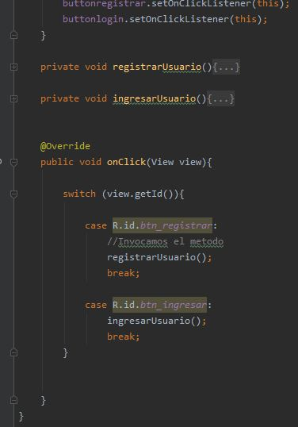
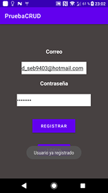
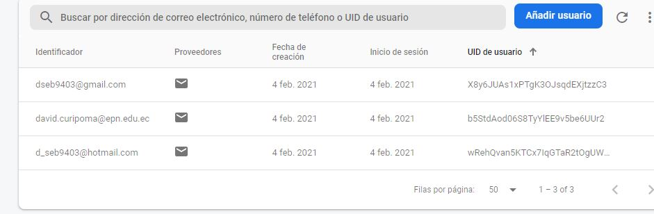
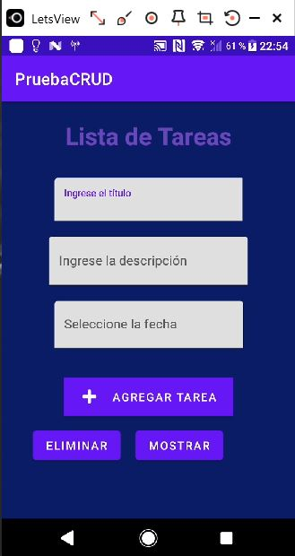
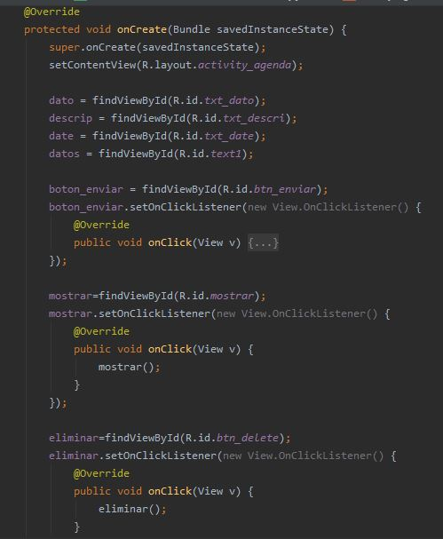
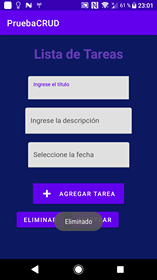
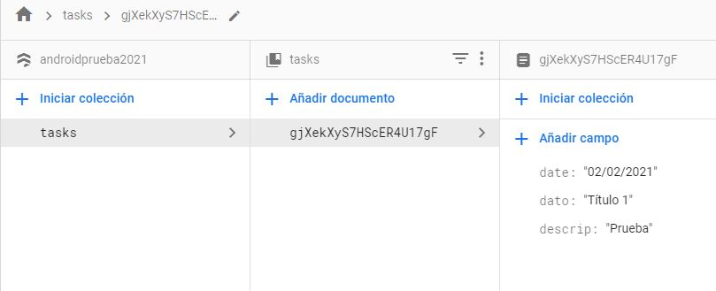

# Prueba de Tópicos Especiales
## App en Android Studio, con método de autenticación, guardar datos con Cloud Firestore, y crud.
### Integrantes: Amagua Jhoel y David Curipoma

### Login y Registro
Al iniciar la aplicación, muestra la pantalla de Registro y Login, en la cual mediante la autenticación 
por correo y contraseña, el usuario puede crear una cuenta, y si esta ya existe, la App arroja un mensaje 
notificando de su ya existencia, después el usuario puede ingresar con sus credenciales.

Estos metodos estarán envueltos en un switch, ya que ambos reciben el id del usuario, en un caso para 
realizar el registro o compronar si el usuario ya existe, y en otro caso para permitir al usuario ingresar.

Y nos mostrará mensajes de error, o exito si el usuario se registra de manera correcta:

### Usuarios
Una vez llenado los datos del registro, los usuarios aparecen en la base de datos de Firebase.

### Tareas
En esta parte, se tiene 3 inputs, en los cuales el usuario llenará los campos con el Título de la tarea, 
su descripción y una fecha, después presionará en Agregar Tarea, lo cual permite que la aplicación se comunique 
con Cloud Firestore, y guarde estos datos.

Podemos ver en el código, que cada input, botones y textos, deben ser declarados y llamados de manera correcta para que funcione.

### Eliminar
En este botón el usuario podrá eliminar los registros guardados anteriormente en la base de datos de Cloud Firestore.

### Cloud Firestore
Podemos observar que los datos enviados mediante el formulario de nuestra aplicación, se guardan en nuestra 
base de datos, y pueden ser consumidos.

